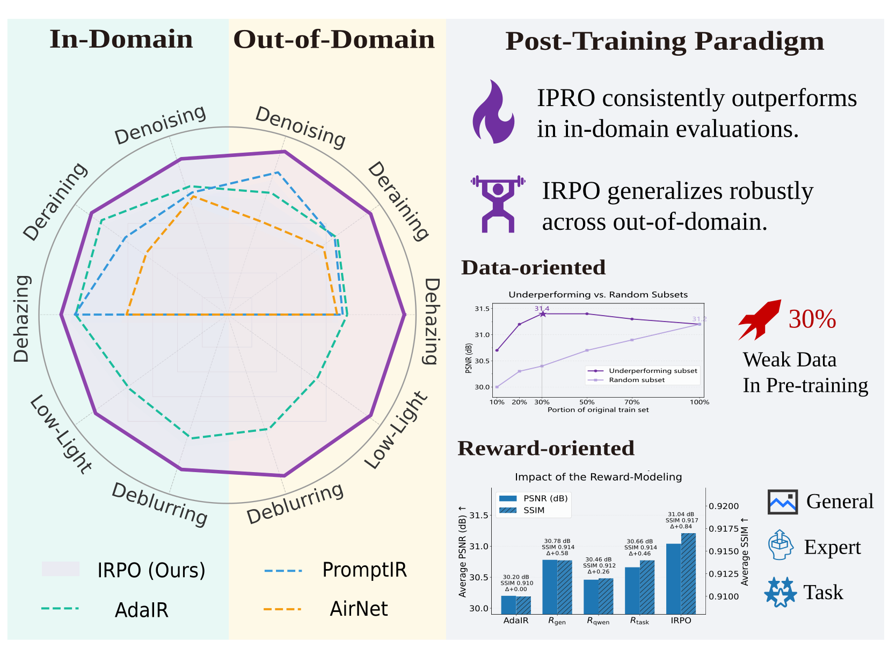
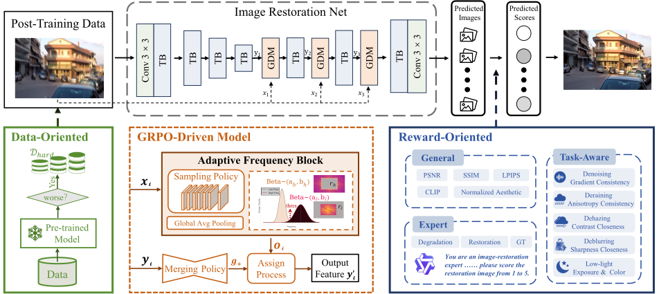
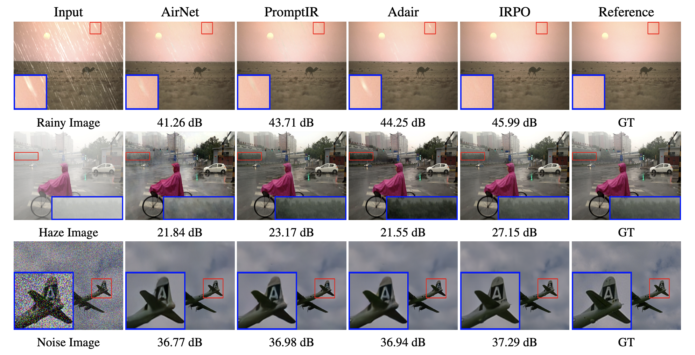
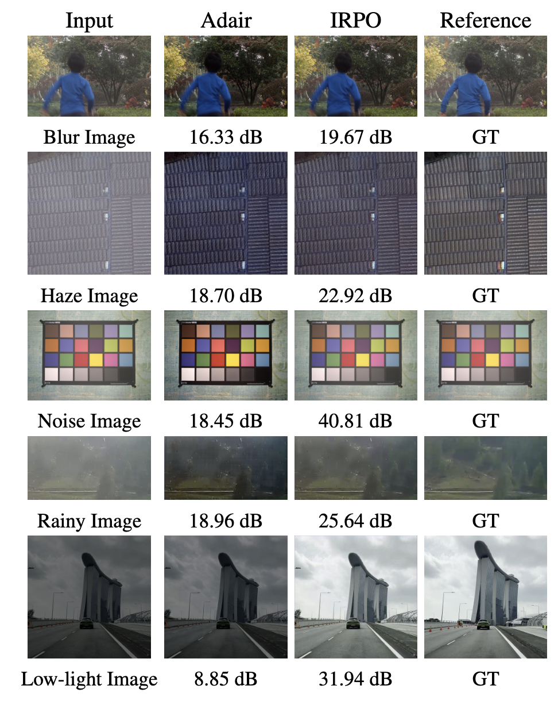
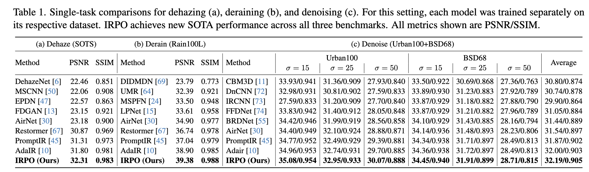
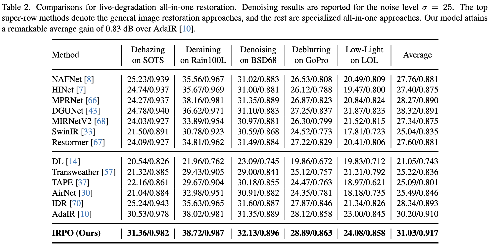
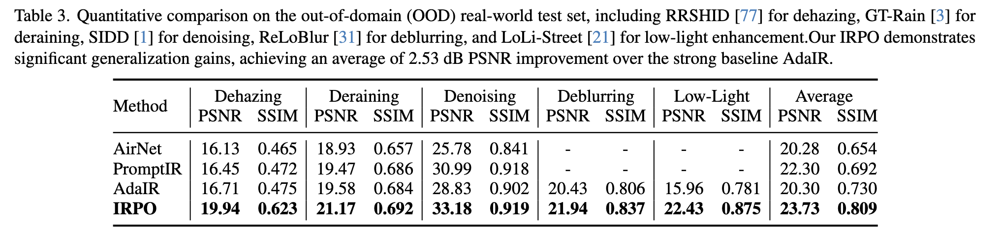

# IRPO
## Boosting Image Restoration via Post-training GRPO

This repository presents **IRPO (Image Restoration Policy Optimization)**, a novel post-training paradigm that achieves state-of-the-art in-domain performance and superior out-of-domain generalization for image restoration tasks.

### Overview

  

An overview of our IRPO post-training paradigm and its performance. (Left) Radar plot comparing average PSNR, showing IRPO achieves SOTA In-Domain performance and vastly superior Out-of-Domain generalization. (Right) The two pillars of our paradigm: Data-oriented, which finds that training on the 30% Weak Data (underperforming subset) is optimal, and Reward-oriented showing the benefit of our reward components.

### Framework

The overview of our proposed post-training paradigm, visually structured around its two pillars. Pillar 1 (Data-Oriented, left): A pre-trained model evaluates the full dataset to curate <i>D</i>hard, which serves as the post-training data. Pillar 2 (Reward-Oriented, right): A multi-component reward model (General, Expert, Task-Aware) provides signals to train the policy (&pi;&theta;). The Image Restoration Net restores underperforming data <i>D</i>hard, including some TB (Transformer Block) and GDM (GRPO-Driven Model, bottom-middle).

Visual comparisons for different restoration tasks. The first row is derain, the second row is dehaze, and the third row is denoise
(noise level 50). Please zoom in for better details

  

Visual comparisons on real-world datasets. From top to
bottom: deblurring, dehazing, denoising, deraining, and low-light
enhancement.Please zoom in for better details.

### Results

Click to view detailed results in Single-task

Click to view detailed results in ive-degradation all-in-one task

Click to view detailed results on the out-of-domain (OOD) real-world test set

